# PayMyBuddy - Déploiement avec Docker

Application de gestion de transactions financières entre amis (Spring Boot + MySQL), dockerisée dans le cadre d'un POC visant à automatiser son déploiement avec Docker Compose et un registre d'images privé.

## Architecture

Le projet repose sur deux services orchestrés par Docker Compose :

- **paymybuddy-backend** : application Spring Boot (Java 17), exposée sur le port 8080
- **paymybuddy-db** : base de données MySQL 8.0, exposée sur le port 3306, initialisée automatiquement via le script `initdb/create.sql`

## Construction de l'image backend

Le `Dockerfile` utilise une construction en deux étapes :

1. Une image `maven:3.9-amazoncorretto-17` compile le code source en un fichier `.jar`
2. Une image finale `amazoncorretto:17-alpine`, plus légère, ne récupère que ce `.jar` pour l'exécuter

Cette approche évite d'avoir à installer Java ou Maven sur la machine hôte, et garde l'image finale aussi légère que possible.

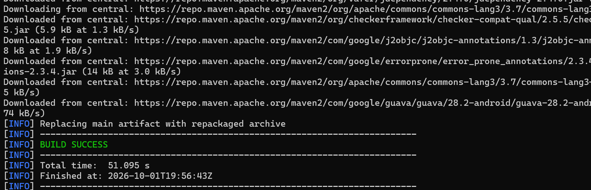

## Lancement avec Docker Compose

Pour construire et démarrer les deux services :

```bash
docker compose up --build
```

Docker Compose construit l'image du backend, démarre MySQL, attend qu'il soit prêt grâce à un `healthcheck` avant de démarrer le backend, qui se connecte alors à la base.

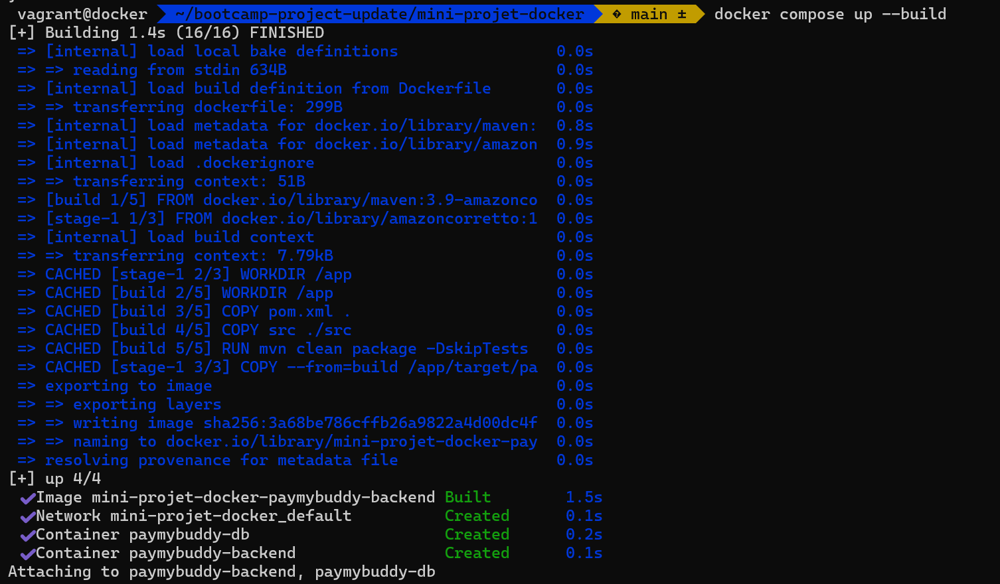
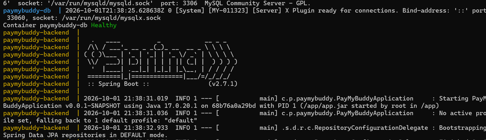
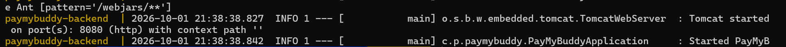
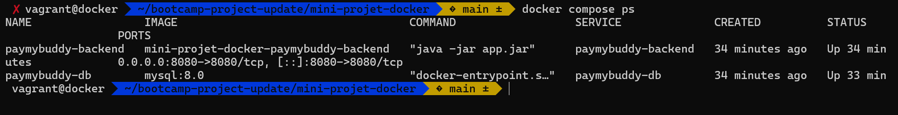

## Sécurisation des identifiants

Les identifiants de connexion à la base (utilisateur, mot de passe) ne sont pas codés en dur dans `docker-compose.yml`. Ils sont définis dans un fichier `.env` (non versionné, listé dans `.gitignore`) et injectés via des variables d'environnement standards reconnues par Spring Boot :

- `SPRING_DATASOURCE_URL`
- `SPRING_DATASOURCE_USERNAME`
- `SPRING_DATASOURCE_PASSWORD`

## Registre Docker privé

Un registre privé est déployé localement avec l'image officielle `registry:2` :

```bash
docker run -d \
  --name registry \
  --restart=always \
  -p 5000:5000 \
  -v registry_data:/var/lib/registry \
  registry:2
```

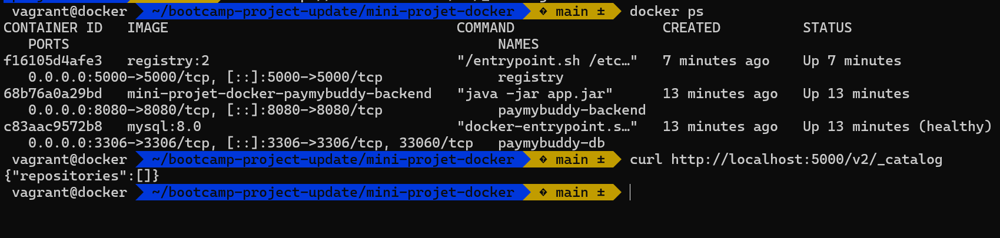

Les deux images du projet (backend et base de données) sont ensuite taguées et poussées vers ce registre :

```bash
docker tag mini-projet-docker-paymybuddy-backend:latest localhost:5000/paymybuddy-backend:latest
docker push localhost:5000/paymybuddy-backend:latest

docker tag mysql:8.0 localhost:5000/paymybuddy-db:latest
docker push localhost:5000/paymybuddy-db:latest
```

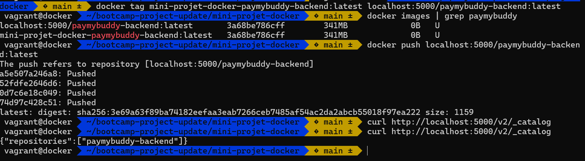
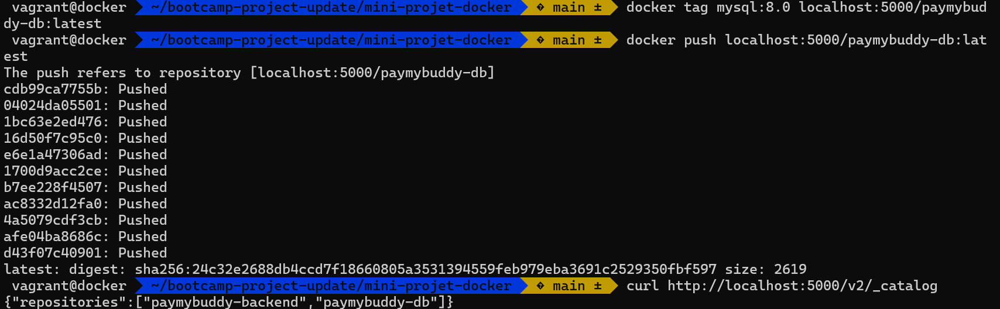

Le fichier `docker-compose.yml` final utilise directement les images issues du registre plutôt qu'un build local :

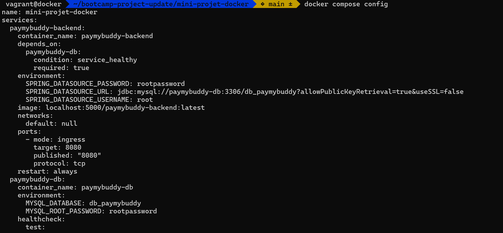
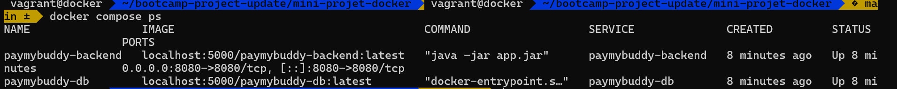

## Application en fonctionnement

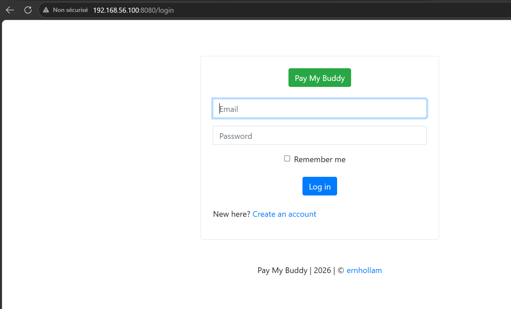

## Démarrage du projet

1. Cloner le dépôt
2. Créer un fichier `.env` à la racine avec les variables suivantes :
MYSQL_ROOT_PASSWORD=motdepasse
MYSQL_DATABASE=db_paymybuddy
SPRING_DATASOURCE_USERNAME=root
SPRING_DATASOURCE_PASSWORD=motdepasse
3. Lancer la stack :
```bash
   docker compose up --build
```
4. Accéder à l'application sur `http://<ip-serveur>:8080`

## Structure du dépôt
mini-projet-docker/
├── Dockerfile
├── docker-compose.yml
├── .env (non versionné)
├── .gitignore
├── initdb/
│ └── create.sql
├── src/
├── pom.xml
├── screenshots/
└── README.md
